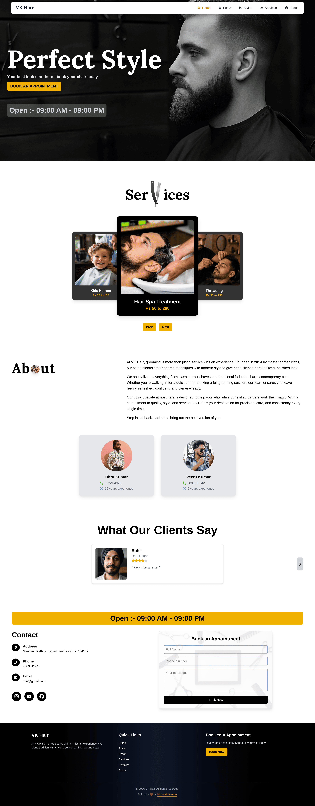
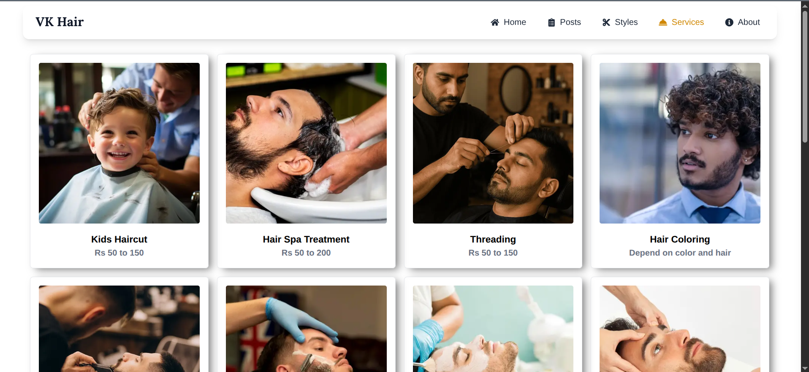
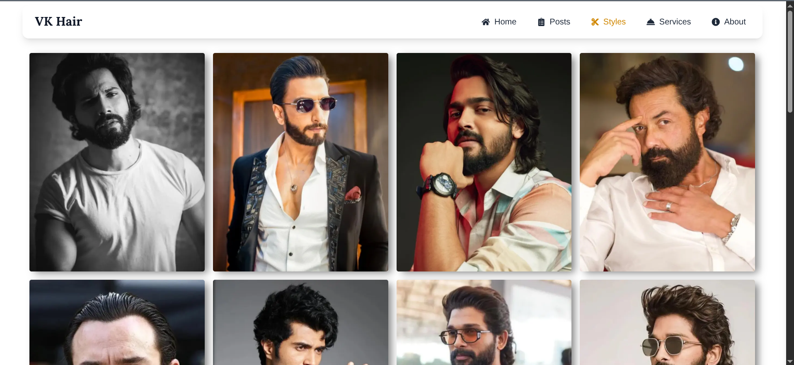
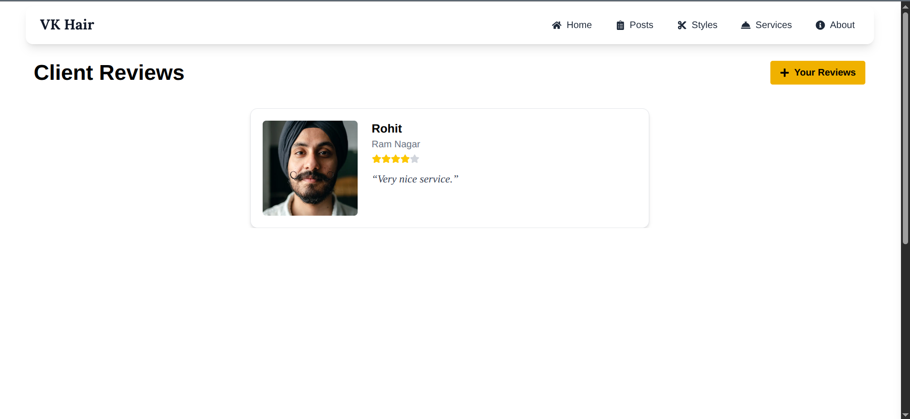
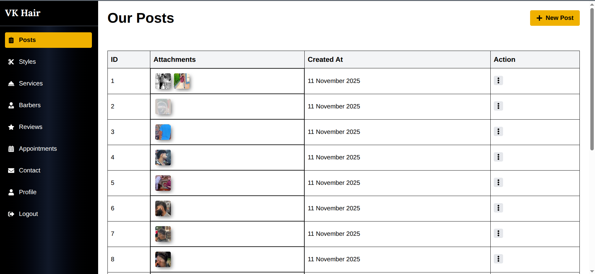
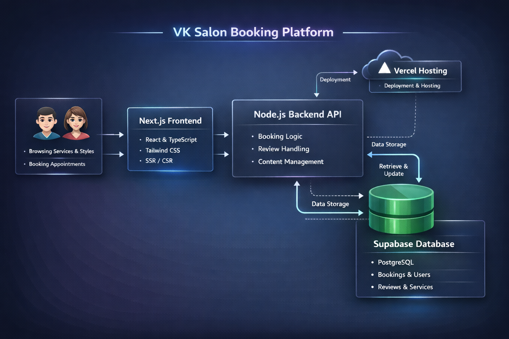

# VK Salon — Modern Salon Booking Platform

VK Salon is a modern full-stack salon booking platform designed to help salon businesses showcase services, display styles, manage customer appointments, and maintain an online presence through a responsive and user-friendly experience.

The platform allows customers to explore services, browse styles, read reviews, and submit appointment requests, while administrators can manage content, appointments, and platform operations through a protected dashboard.

> Built independently as a complete end-to-end service booking platform.

---

## 🌐 Live Demo

🔗 Demo: https://vk-salon.vercel.app

---

## 📸 Screenshots

### Landing Page


### Services Section


### Style Showcase


### Appointment Booking


### Reviews Section


### Admin Management


### Mobile Responsive Design


---

## 🧠 Architecture Diagram

<p align="center">
  
</p>

---

## 🚀 Features

### Public Features
- Browse salon services and pricing
- Explore hairstyle and barber showcase sections
- View public posts and updates
- Submit appointment requests
- Read and submit customer reviews
- Responsive browsing experience across devices

---

### Appointment System
- Simple appointment request workflow
- Customers submit:
  - name
  - phone number
  - message
- Appointment data stored in database
- Admin can review and manage booking requests

---

### Admin Features
- Secure admin authentication using NextAuth
- Manage services and pricing
- Add, edit, and delete styles
- Manage posts and content
- View and manage appointment requests
- Moderate customer reviews

---

## 🏗️ Project Overview

VK Salon was designed as a modern service-based platform focused on improving salon visibility and simplifying appointment management.

The application combines:
- public service presentation
- style showcase system
- customer review system
- appointment management
- admin-controlled content management

The platform focuses on responsive UI, smooth user experience, and structured content management.

---

## 🧠 System Architecture

VK Salon follows a modern Next.js full-stack architecture using server-side rendering and managed backend services.

### Frontend
- Next.js
- TypeScript
- Tailwind CSS
- Reusable component architecture

### Backend
- Next.js API Routes
- NextAuth Authentication

### Database & Storage
- PostgreSQL
- Firebase Storage

### Deployment
- Vercel Hosting
- Environment-based configuration

---

## ⚙️ Tech Stack

### Frontend
- Next.js
- TypeScript
- Tailwind CSS

### Backend
- Next.js API Routes
- NextAuth

### Database & Storage
- PostgreSQL
- Firebase

### Deployment & Infrastructure
- Vercel

---

## 🧩 Core Systems

### Service Management System
- Display services with pricing
- Structured service presentation
- Dynamic service management

---

### Style Showcase System
- Display hairstyle collections
- Visual style browsing
- Public style pages

---

### Appointment Management System
- Customer booking requests
- Appointment storage in database
- Admin-side appointment management

---

### Review System
- Customer review submission
- Public review display
- Feedback management

---

### Content Management System
- Public post visibility
- Admin-controlled content updates
- Dynamic content sections

---

## 🧠 Technical Highlights

### Modern Frontend Architecture
Built using Next.js App Router with reusable component structure and modular directory organization.

### Responsive Mobile-First Design
Implemented responsive layouts using Tailwind CSS with consistent UI across devices.

### SEO & Performance Optimization
Implemented:
- SSR (Server-Side Rendering)
- SSG (Static Site Generation)
- image optimization
- loading states

### Dynamic Content Management
Built dynamic routes and reusable systems for services, styles, posts, and reviews.

### Authentication & Admin Protection
Implemented secure admin authentication using NextAuth with protected dashboard access.

---

## 📁 Project Structure

```bash
vk-salon/
├── app/
├── components/
├── lib/
├── context/
├── types/
├── public/
├── styles/
└── utils/
```

---

## 🛠️ Installation

### Clone Repository

```bash
git clone https://github.com/thappamkkumar/vk-salon.git
```

---

### Install Dependencies

```bash
npm install
```

---

### Configure Environment Variables

Create `.env.local` and configure:
- database credentials
- Firebase configuration
- NextAuth secrets

---

### Start Development Server

```bash
npm run dev
```

---

## 🔐 Authentication

- Admin authentication using NextAuth
- Protected admin dashboard
- Secure admin-only operations

---

## 📈 Engineering Highlights

- Independently built full-stack booking platform
- Implemented responsive mobile-first UI
- Built reusable component architecture
- Integrated PostgreSQL and Firebase services
- Implemented SEO optimization using SSR & SSG
- Developed dynamic content management system
- Managed deployment and hosting on Vercel

---

## 📌 Future Improvements

- Real-time appointment updates
- Email notifications
- Customer authentication system
- Online payment integration
- Appointment scheduling calendar
- Analytics dashboard

---

## 👨‍💻 Author

Mukesh Kumar

- Portfolio: https://mukeshkumar.vercel.app/
- GitHub: https://github.com/thappamkkumar
